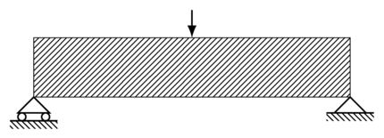
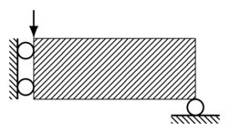
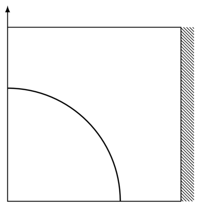
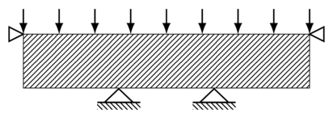
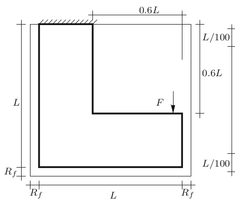
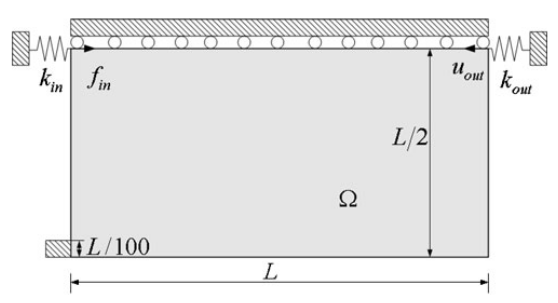
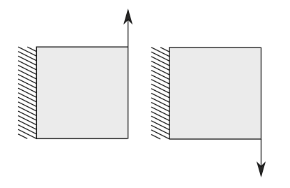
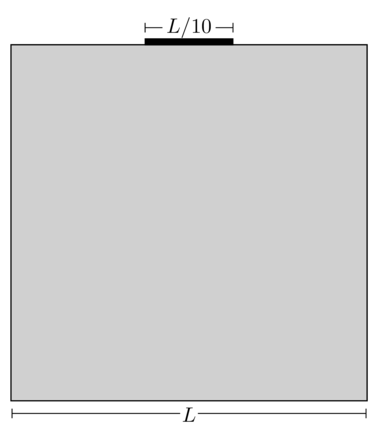

# Ejemplos de Optimización Topológica en MATLAB/Octave

### Basados en el código del artículo: "Efficient topology optimization in MATLAB using 88 lines of code"  
Ver más opciones de código en: http://www.topopt.mek.dtu.dk/apps-and-software

#### Elementos finitos para calor y elasticidad en 2D
Solución numérica de la ecuación de calor y elasticidad mediante elementos finitos.
* [`FEM/heat2D`](FEM/heat2D.m) 
* [`FEM/elasticity2D`](FEM/elasticity2D.m)

#### Ejemplos de Optimización
1. Ejemplo MBB  
Se simula una barra de material sobre dos soportes y sujeta a una fuerza en el centro.    
[`MBB_complete.m`](MBB_complete.m)  

 

2. MBB simétrico  
En el caso anterior se puede simular la mitad del dominio debido a que el resultado es simétrico.  
[`MBB.m`](MBB.m)  
Para ejecutar `MBB.m` se deben ingresar los siguientes parámetros: 
`MBB(nelx,nely,volfrac,penal,rmin,ft)`
   * `nelx`: número de elementos en x
   * `nely`: número de elementos en y
   * `volfrac`: fracción de volumen
   * `penal`: penalidad en el SIMP
   * `rmin`: radio de aplicación del filtro
   * `ft`: tipo de filtro  
Por ejemplo, ejecutar con las siguientes opciones: `MBB(60,20,0.5,3.0,2.4,2)`  

 

Estudiaremos las opciones 
   * Zonas grises, SIMP (penal)  
    `MBB(60,20,0.5,1.0,2.4,2)`  
    
   * Patrón ajedrezado e independencia del mallado, Filtros (rmin)  
    `MBB(120,40,0.5,3.0,0.01,2)`
   
3. Diseño sencillo de una bicicleta  
En este ejemplo se diseña una bicicleta con las condiciones de la figura.  
[`bicycle_single_load.m`](bicycle_single_load.m)

  

4. Ejemplo de un puente  
Ejemplo sencillo del diseño de un puente.  
[`bridge.m`](bridge.m)

  

5. Soporte en L  
Diseño de un soporte en forma de L.    
[`Lbracket.m`](Lbracket.m)  

  

6. Inversor de una fuerza  
En este caso se realiza una fuerza y se requiere maximizar un desplazamiento en dirección contraria a la fuerza aplicada como en la figura.   
[`inverter.m`](inverter.m)  

  

7. Soporte bajo múltiples cargas  
Diseño de un soporte bajo múltiples cargas no simultáneas.  
[`multiple_loads.m`](multiple_loads.m)  

  

8. MBB robusto  
Opción de diseño robusto para el MBB (se evita la formación de áreas grises y de secciones muy delgadas de material para asegurar su manufacturabilidad).   
[`robust_MBB.m`](robust_MBB.m)

9. Simulación para la ecuación del calor  
Aquí se simula un sumidero utilizando la ecuación del calor. En la parte negra del borde fijamos la temperatura en cero y se suministra una fuente de calor uniforme en todo el dominio.  
[`heat_sink.m`](heat_sink.m)  

  

10. Simulación para la ecuación del calor, con un forzante sobre un cuadrado fijo  
Ejemplo con un forzante sobre un area fija del dominio.  
[`square.m`](square.m)

11. Optimización en 3 dimensiones para el MBB simétrico, tomado de [top3D](http://www.top3dapp.com/)  
Ejecutar, por ejemplo, con los siguientes parámetros: `top3d(16,8,8,0.5,3.0,2.0)`  
[`top3d.m`](top3d.m)

#### Archivos de MATLAB necesarios para el método MMA
Códigos en MATLAB para el método de optimización MMA (Mixed Moving Asymptotes)  
* [mmasub.m](https://pastebin.ubuntu.com/p/YNc4sg5ckB/)
* [subsolv.m](https://pastebin.ubuntu.com/p/y4pydcMWxX/)

### Two Levels Preconditioners (in progress)
Ejemplos de optimización topológica utilizando precondicionadores de dos niveles.  
1. Elasticity basis

2. Heat basis

3. [Random heat basis](Two%20Levels%20Preconditioners/Random%20heat%20basis)
